# 客服打赏系统 (Tip-Plugin) — 技术架构与实现逻辑

> **版本**: v2.0.0-modular  
> **技术栈**: Express 5 + Supabase + PayPal REST SDK + Intercom Canvas  
> **部署**: Vercel Serverless  
> **生成日期**: 2026-03-23

---

## 1. 项目整体架构

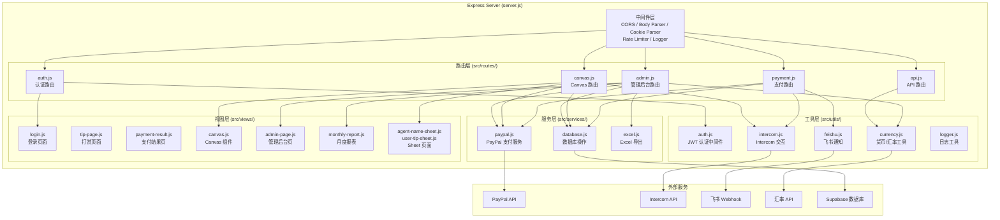
```mermaid
graph TB
    subgraph "外部服务"
        PayPal["PayPal API"]
        Intercom["Intercom API"]
        Feishu["飞书 Webhook"]
        ExRate["汇率 API"]
        Supabase["Supabase 数据库"]
    end

    subgraph "Express Server (server.js)"
        MW["中间件层<br/>CORS / Body Parser / Cookie Parser<br/>Rate Limiter / Logger"]

        subgraph "路由层 (src/routes/)"
            AuthR["auth.js<br/>认证路由"]
            PayR["payment.js<br/>支付路由"]
            CanvasR["canvas.js<br/>Canvas 路由"]
            ApiR["api.js<br/>API 路由"]
            AdminR["admin.js<br/>管理后台路由"]
        end

        subgraph "服务层 (src/services/)"
            PayPalS["paypal.js<br/>PayPal 支付服务"]
            DBS["database.js<br/>数据库操作"]
            ExcelS["excel.js<br/>Excel 导出"]
        end

        subgraph "工具层 (src/utils/)"
            AuthU["auth.js<br/>JWT 认证中间件"]
            CurrU["currency.js<br/>货币/汇率工具"]
            InterU["intercom.js<br/>Intercom 交互"]
            FeishuU["feishu.js<br/>飞书通知"]
            LogU["logger.js<br/>日志工具"]
        end

        subgraph "视图层 (src/views/)"
            LoginV["login.js<br/>登录页面"]
            TipV["tip-page.js<br/>打赏页面"]
            ResultV["payment-result.js<br/>支付结果页"]
            CanvasV["canvas.js<br/>Canvas 组件"]
            AdminV["admin-page.js<br/>管理后台页"]
            MonthV["monthly-report.js<br/>月度报表"]
            SheetV["agent-name-sheet.js<br/>user-tip-sheet.js<br/>Sheet 页面"]
        end
    end

    MW --> AuthR & PayR & CanvasR & ApiR & AdminR
    PayR --> PayPalS & DBS & InterU & FeishuU
    CanvasR --> PayPalS & DBS & InterU & CanvasV & SheetV
    AdminR --> DBS & PayPalS & ExcelS & CurrU & AdminV & MonthV
    ApiR --> CurrU
    AuthR --> AuthU & LoginV
    DBS --> Supabase
    PayPalS --> PayPal
    InterU --> Intercom
    FeishuU --> Feishu
    CurrU --> ExRate
```

---

## 2. 模块职责说明

| 层级 | 模块 | 职责 |
|------|------|------|
| **配置** | `config/index.js` | 集中管理 Supabase、PayPal、Intercom、飞书、JWT、费率等配置；初始化 Supabase Client |
| **路由** | `routes/auth.js` | 处理管理员登录/登出（JWT Cookie） |
| **路由** | `routes/payment.js` | 打赏页面渲染、创建 PayPal 支付、支付成功/取消回调 |
| **路由** | `routes/canvas.js` | Intercom Canvas 应用（客服端 + 用户端）的初始化和交互 |
| **路由** | `routes/api.js` | API 端点（目前仅汇率查询） |
| **路由** | `routes/admin.js` | 管理后台首页、退款处理、Excel 导出 |
| **服务** | `services/paypal.js` | PayPal 支付创建、执行、退款 |
| **服务** | `services/database.js` | Supabase CRUD（tips 表），含幂等创建、状态更新、分页查询 |
| **服务** | `services/excel.js` | 月度报表 Excel 生成（汇总 + 排行 + 明细 3 个 Sheet） |
| **工具** | `utils/auth.js` | JWT 生成/验证、`requireAuth` 中间件 |
| **工具** | `utils/currency.js` | USD→CNY 汇率获取（10min 缓存）、PayPal 手续费计算、货币格式化 |
| **工具** | `utils/intercom.js` | 提取对话 ID/客服名、发送打赏消息/支付成功消息 |
| **工具** | `utils/feishu.js` | 飞书群卡片通知（支付成功后） |
| **工具** | `utils/logger.js` | 分级日志（生产环境自动简化） |
| **视图** | `views/*.js` | 服务端 HTML 渲染（登录页、打赏页、支付结果页、管理后台） |
| **视图** | `views/canvas.js` | Intercom Canvas JSON 组件生成 |

---

## 3. 数据库模型 (Supabase `tips` 表)

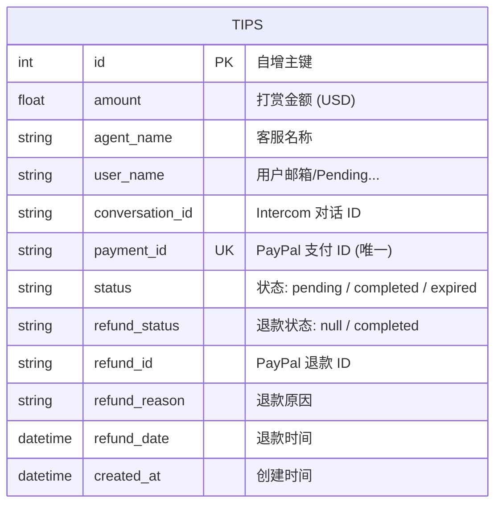
```mermaid
erDiagram
    TIPS {
        int id PK "自增主键"
        float amount "打赏金额 (USD)"
        string agent_name "客服名称"
        string user_name "用户邮箱/Pending..."
        string conversation_id "Intercom 对话 ID"
        string payment_id UK "PayPal 支付 ID (唯一)"
        string status "状态: pending / completed / expired"
        string refund_status "退款状态: null / completed"
        string refund_id "PayPal 退款 ID"
        string refund_reason "退款原因"
        datetime refund_date "退款时间"
        datetime created_at "创建时间"
    }
```

---

## 4. 核心业务流程

### 4.1 用户打赏 — 完整支付流程

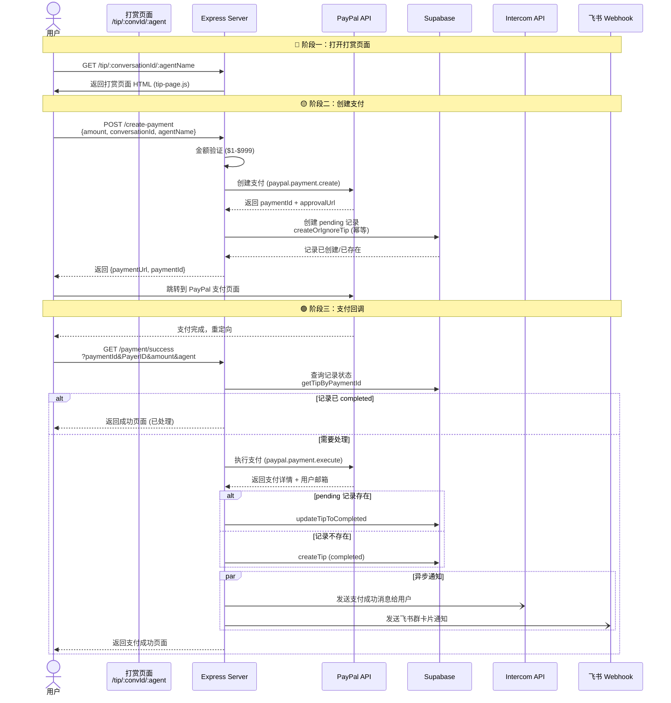
```mermaid
sequenceDiagram
    actor User as 用户
    participant TipPage as 打赏页面<br/>/tip/:convId/:agent
    participant Server as Express Server
    participant PayPal as PayPal API
    participant DB as Supabase
    participant Intercom as Intercom API
    participant Feishu as 飞书 Webhook

    Note over User,Feishu: 🔵 阶段一：打开打赏页面
    User->>Server: GET /tip/:conversationId/:agentName
    Server->>User: 返回打赏页面 HTML (tip-page.js)

    Note over User,Feishu: 🟡 阶段二：创建支付
    User->>Server: POST /create-payment<br/>{amount, conversationId, agentName}
    Server->>Server: 金额验证 ($1-$999)
    Server->>PayPal: 创建支付 (paypal.payment.create)
    PayPal-->>Server: 返回 paymentId + approvalUrl

    Server->>DB: 创建 pending 记录<br/>createOrIgnoreTip (幂等)
    DB-->>Server: 记录已创建/已存在

    Server-->>User: 返回 {paymentUrl, paymentId}
    User->>PayPal: 跳转到 PayPal 支付页面

    Note over User,Feishu: 🟢 阶段三：支付回调
    PayPal-->>User: 支付完成，重定向
    User->>Server: GET /payment/success<br/>?paymentId&PayerID&amount&agent

    Server->>DB: 查询记录状态<br/>getTipByPaymentId
    alt 记录已 completed
        Server-->>User: 返回成功页面 (已处理)
    else 需要处理
        Server->>PayPal: 执行支付 (paypal.payment.execute)
        PayPal-->>Server: 返回支付详情 + 用户邮箱

        alt pending 记录存在
            Server->>DB: updateTipToCompleted
        else 记录不存在
            Server->>DB: createTip (completed)
        end

        par 异步通知
            Server-)Intercom: 发送支付成功消息给用户
            Server-)Feishu: 发送飞书群卡片通知
        end

        Server-->>User: 返回支付成功页面
    end
```

### 4.2 Intercom Canvas 打赏流程 (客服端 → 用户端)

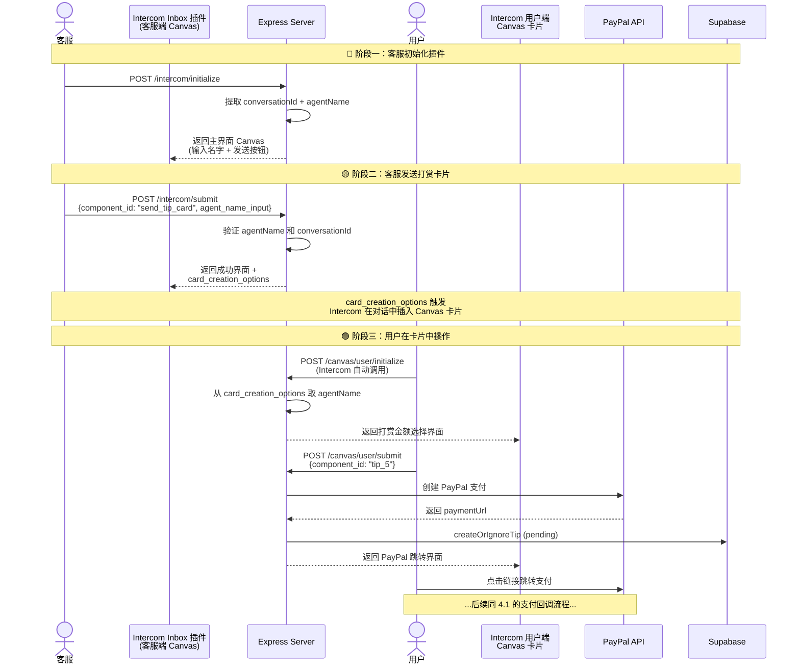
```mermaid
sequenceDiagram
    actor Agent as 客服
    participant InboxApp as Intercom Inbox 插件<br/>(客服端 Canvas)
    participant Server as Express Server
    actor User as 用户
    participant UserCard as Intercom 用户端<br/>Canvas 卡片
    participant PayPal as PayPal API
    participant DB as Supabase

    Note over Agent,DB: 🔵 阶段一：客服初始化插件
    Agent->>Server: POST /intercom/initialize
    Server->>Server: 提取 conversationId + agentName
    Server-->>InboxApp: 返回主界面 Canvas<br/>(输入名字 + 发送按钮)

    Note over Agent,DB: 🟡 阶段二：客服发送打赏卡片
    Agent->>Server: POST /intercom/submit<br/>{component_id: "send_tip_card", agent_name_input}
    Server->>Server: 验证 agentName 和 conversationId
    Server-->>InboxApp: 返回成功界面 +<br/>card_creation_options

    Note over Agent,DB: card_creation_options 触发<br/>Intercom 在对话中插入 Canvas 卡片

    Note over Agent,DB: 🟢 阶段三：用户在卡片中操作
    User->>Server: POST /canvas/user/initialize<br/>(Intercom 自动调用)
    Server->>Server: 从 card_creation_options 取 agentName
    Server-->>UserCard: 返回打赏金额选择界面

    User->>Server: POST /canvas/user/submit<br/>{component_id: "tip_5"}
    Server->>PayPal: 创建 PayPal 支付
    PayPal-->>Server: 返回 paymentUrl
    Server->>DB: createOrIgnoreTip (pending)
    Server-->>UserCard: 返回 PayPal 跳转界面

    User->>PayPal: 点击链接跳转支付
    Note over User,PayPal: ...后续同 4.1 的支付回调流程...
```

### 4.3 Canvas 用户端交互状态机

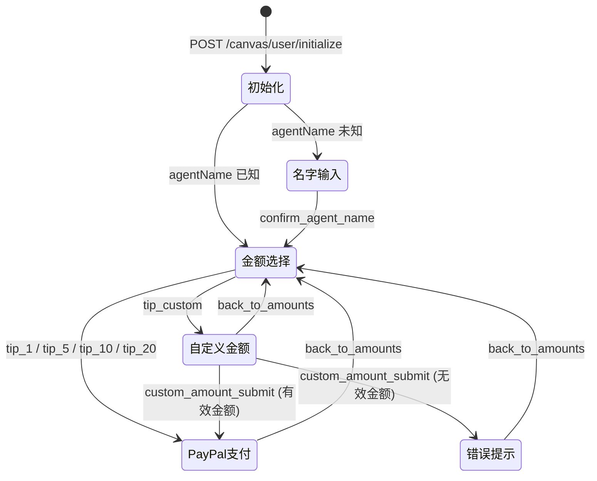
```mermaid
stateDiagram-v2
    [*] --> 初始化: POST /canvas/user/initialize

    初始化 --> 名字输入: agentName 未知
    初始化 --> 金额选择: agentName 已知

    名字输入 --> 金额选择: confirm_agent_name
    
    金额选择 --> PayPal支付: tip_1 / tip_5 / tip_10 / tip_20
    金额选择 --> 自定义金额: tip_custom
    
    自定义金额 --> PayPal支付: custom_amount_submit (有效金额)
    自定义金额 --> 错误提示: custom_amount_submit (无效金额)
    自定义金额 --> 金额选择: back_to_amounts

    PayPal支付 --> 金额选择: back_to_amounts
    
    错误提示 --> 金额选择: back_to_amounts
```

### 4.4 Canvas 客服端交互状态机

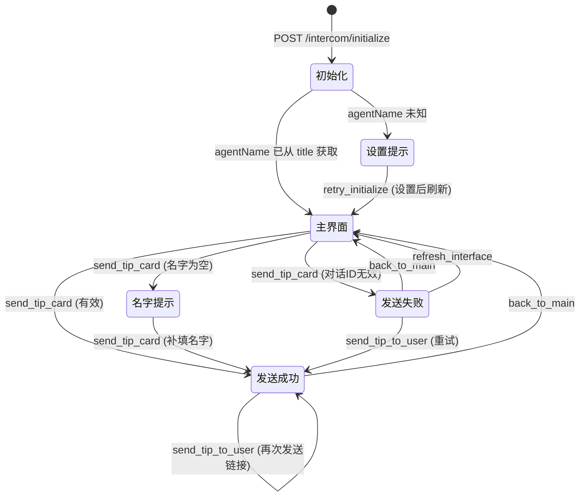
```mermaid
stateDiagram-v2
    [*] --> 初始化: POST /intercom/initialize

    初始化 --> 主界面: agentName 已从 title 获取
    初始化 --> 设置提示: agentName 未知

    设置提示 --> 主界面: retry_initialize (设置后刷新)

    主界面 --> 发送成功: send_tip_card (有效)
    主界面 --> 名字提示: send_tip_card (名字为空)
    主界面 --> 发送失败: send_tip_card (对话ID无效)

    名字提示 --> 发送成功: send_tip_card (补填名字)

    发送成功 --> 主界面: back_to_main
    发送成功 --> 发送成功: send_tip_to_user (再次发送链接)

    发送失败 --> 主界面: back_to_main
    发送失败 --> 发送成功: send_tip_to_user (重试)
    发送失败 --> 主界面: refresh_interface
```

---

## 5. 管理后台功能流程

### 5.1 管理后台访问

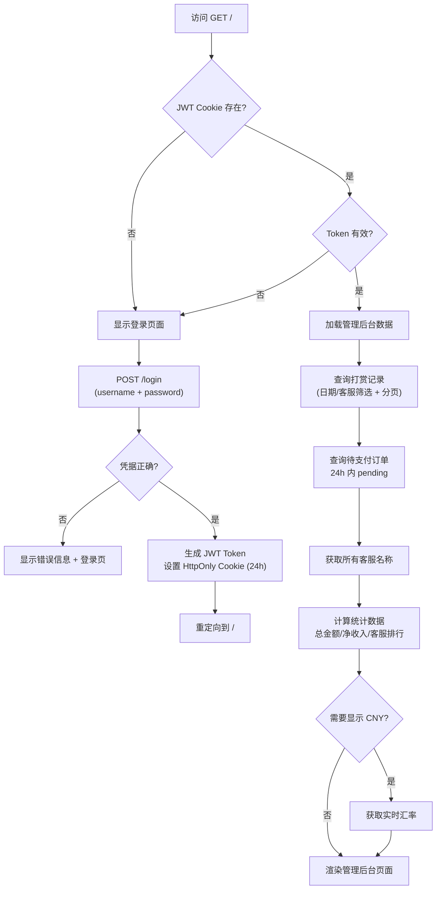
```mermaid
flowchart TD
    A[访问 GET /] --> B{JWT Cookie 存在?}
    B -- 否 --> C[显示登录页面]
    C --> D["POST /login<br/>(username + password)"]
    D --> E{凭据正确?}
    E -- 否 --> F[显示错误信息 + 登录页]
    E -- 是 --> G["生成 JWT Token<br/>设置 HttpOnly Cookie (24h)"]
    G --> H[重定向到 /]
    B -- 是 --> I{Token 有效?}
    I -- 否 --> C
    I -- 是 --> J[加载管理后台数据]
    
    J --> K["查询打赏记录<br/>(日期/客服筛选 + 分页)"]
    K --> L[查询待支付订单<br/>24h 内 pending]
    L --> M[获取所有客服名称]
    M --> N[计算统计数据<br/>总金额/净收入/客服排行]
    N --> O{需要显示 CNY?}
    O -- 是 --> P[获取实时汇率]
    O -- 否 --> Q[渲染管理后台页面]
    P --> Q
```

### 5.2 退款流程

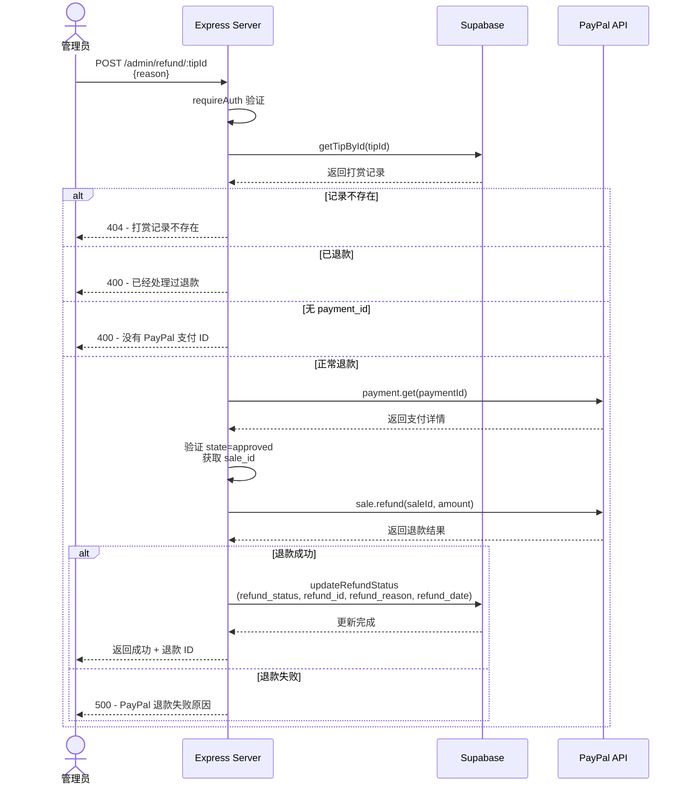
```mermaid
sequenceDiagram
    actor Admin as 管理员
    participant Server as Express Server
    participant DB as Supabase
    participant PayPal as PayPal API

    Admin->>Server: POST /admin/refund/:tipId<br/>{reason}
    Server->>Server: requireAuth 验证

    Server->>DB: getTipById(tipId)
    DB-->>Server: 返回打赏记录

    alt 记录不存在
        Server-->>Admin: 404 - 打赏记录不存在
    else 已退款
        Server-->>Admin: 400 - 已经处理过退款
    else 无 payment_id
        Server-->>Admin: 400 - 没有 PayPal 支付 ID
    else 正常退款
        Server->>PayPal: payment.get(paymentId)
        PayPal-->>Server: 返回支付详情

        Server->>Server: 验证 state=approved<br/>获取 sale_id

        Server->>PayPal: sale.refund(saleId, amount)
        PayPal-->>Server: 返回退款结果

        alt 退款成功
            Server->>DB: updateRefundStatus<br/>(refund_status, refund_id, refund_reason, refund_date)
            DB-->>Server: 更新完成
            Server-->>Admin: 返回成功 + 退款 ID
        else 退款失败
            Server-->>Admin: 500 - PayPal 退款失败原因
        end
    end
```

### 5.3 月度报表与 Excel 导出

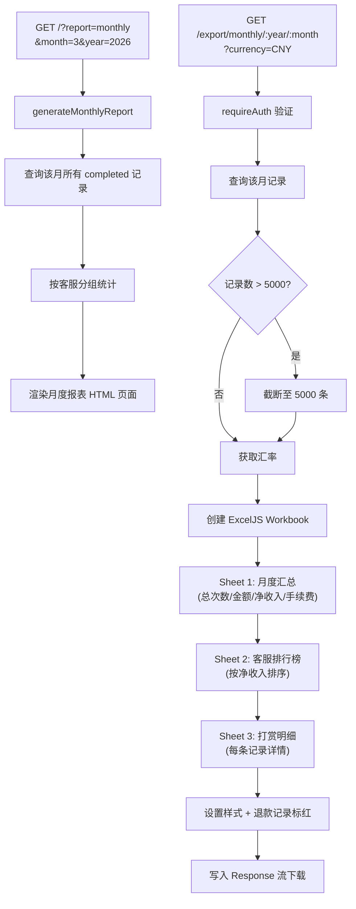
```mermaid
flowchart TD
    A["GET /?report=monthly<br/>&month=3&year=2026"] --> B[generateMonthlyReport]
    B --> C[查询该月所有 completed 记录]
    C --> D[按客服分组统计]
    D --> E[渲染月度报表 HTML 页面]

    F["GET /export/monthly/:year/:month<br/>?currency=CNY"] --> G[requireAuth 验证]
    G --> H[查询该月记录]
    H --> I{记录数 > 5000?}
    I -- 是 --> J[截断至 5000 条]
    I -- 否 --> K[获取汇率]
    J --> K
    K --> L[创建 ExcelJS Workbook]
    L --> M["Sheet 1: 月度汇总<br/>(总次数/金额/净收入/手续费)"]
    M --> N["Sheet 2: 客服排行榜<br/>(按净收入排序)"]
    N --> O["Sheet 3: 打赏明细<br/>(每条记录详情)"]
    O --> P[设置样式 + 退款记录标红]
    P --> Q[写入 Response 流下载]
```

---

## 6. 认证机制

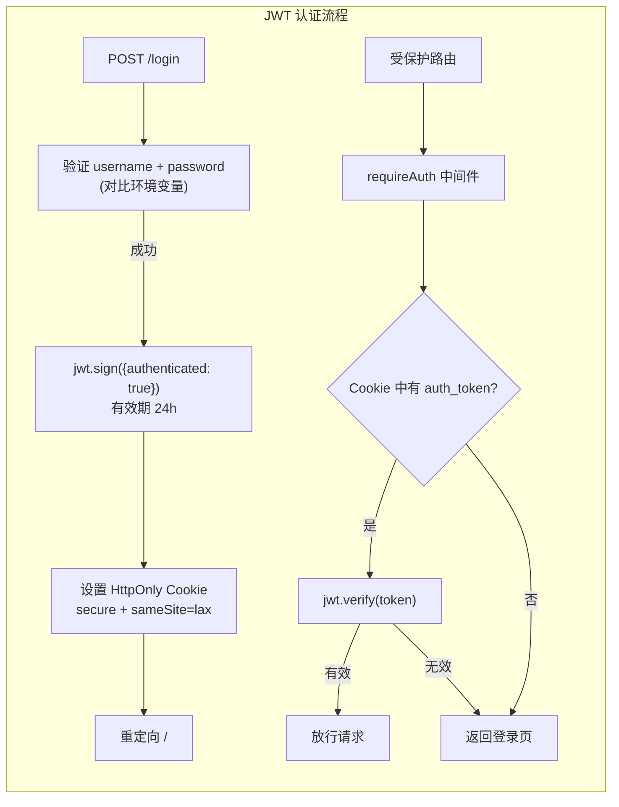
```mermaid
flowchart LR
    subgraph "JWT 认证流程"
        A[POST /login] --> B["验证 username + password<br/>(对比环境变量)"]
        B -- 成功 --> C["jwt.sign({authenticated: true})<br/>有效期 24h"]
        C --> D["设置 HttpOnly Cookie<br/>secure + sameSite=lax"]
        D --> E[重定向 /]

        F[受保护路由] --> G["requireAuth 中间件"]
        G --> H{Cookie 中有 auth_token?}
        H -- 是 --> I["jwt.verify(token)"]
        I -- 有效 --> J[放行请求]
        I -- 无效 --> K[返回登录页]
        H -- 否 --> K
    end
```

---

## 7. 速率限制策略

| 端点 | 限制 | 窗口 | 说明 |
|------|------|------|------|
| `POST /login` | 5 次 | 15 分钟 | 仅计算失败请求（`skipSuccessfulRequests: true`） |
| `/api/*` | 100 次 | 1 分钟 | 通用 API 限制 |
| `POST /create-payment` | 100 次 | 1 分钟 | 防止恶意创建支付 |

---

## 8. 关键技术决策

### 8.1 支付记录幂等性

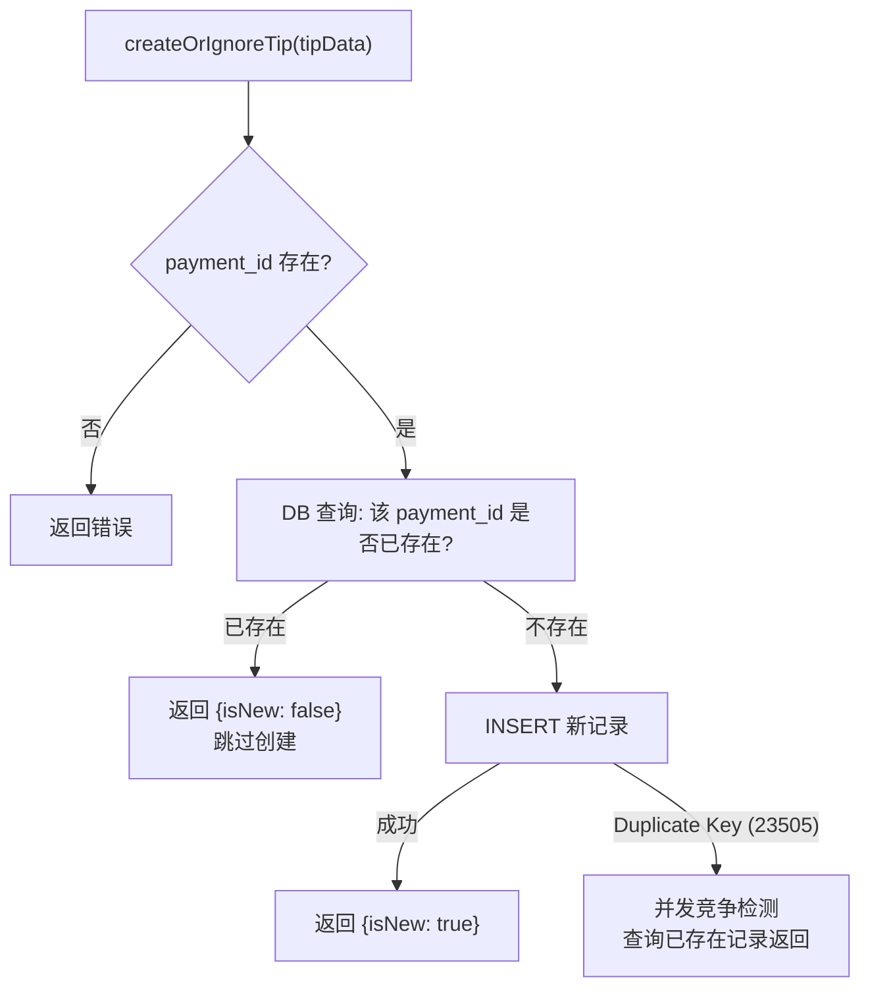
```mermaid
flowchart TD
    A["createOrIgnoreTip(tipData)"] --> B{payment_id 存在?}
    B -- 否 --> C[返回错误]
    B -- 是 --> D["DB 查询: 该 payment_id 是否已存在?"]
    D -- 已存在 --> E["返回 {isNew: false}<br/>跳过创建"]
    D -- 不存在 --> F["INSERT 新记录"]
    F -- 成功 --> G["返回 {isNew: true}"]
    F -- "Duplicate Key (23505)" --> H["并发竞争检测<br/>查询已存在记录返回"]
```

> **为什么需要幂等性？**  
> Canvas 路由和 Payment 路由可能同时创建相同 `payment_id` 的记录（用户从 Canvas 卡片和网页两个入口发起打赏）。使用 "先查后插" + 唯一约束 fallback 策略，确保不会产生重复记录。

### 8.2 支付回调的状态机保护

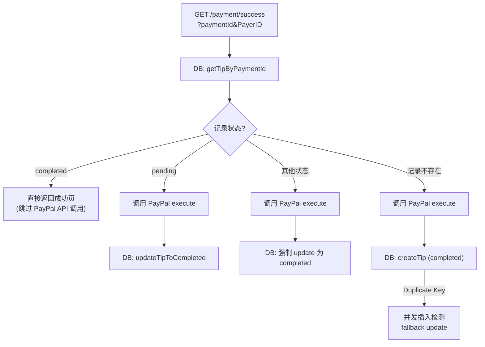
```mermaid
flowchart TD
    A["GET /payment/success<br/>?paymentId&PayerID"] --> B["DB: getTipByPaymentId"]
    B --> C{记录状态?}
    
    C -- "completed" --> D["直接返回成功页<br/>(跳过 PayPal API 调用)"]
    
    C -- "pending" --> E["调用 PayPal execute"]
    E --> F["DB: updateTipToCompleted"]
    
    C -- "其他状态" --> E2["调用 PayPal execute"]
    E2 --> G["DB: 强制 update 为 completed"]
    
    C -- "记录不存在" --> E3["调用 PayPal execute"]
    E3 --> H["DB: createTip (completed)"]
    H -- "Duplicate Key" --> I["并发插入检测<br/>fallback update"]
```

> **防重复回调**: 用户刷新支付成功页面时，会重复触发 `/payment/success`。通过先检查数据库状态，避免重复调用 PayPal API。

### 8.3 Intercom 客服名称提取优先级

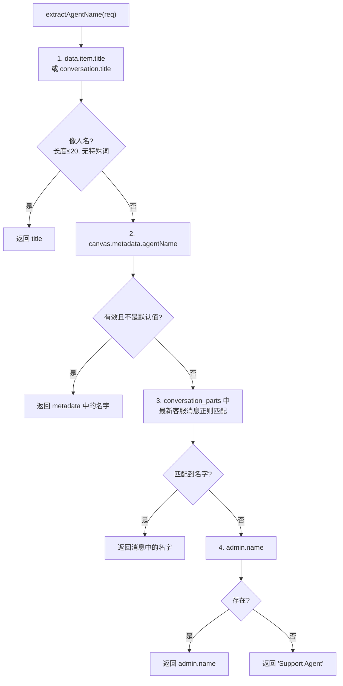
```mermaid
flowchart TD
    A["extractAgentName(req)"] --> B["1. data.item.title<br/>或 conversation.title"]
    B --> C{像人名?<br/>长度≤20, 无特殊词}
    C -- 是 --> D["返回 title"]
    C -- 否 --> E["2. canvas.metadata.agentName"]
    E --> F{有效且不是默认值?}
    F -- 是 --> G["返回 metadata 中的名字"]
    F -- 否 --> H["3. conversation_parts 中<br/>最新客服消息正则匹配"]
    H --> I{匹配到名字?}
    I -- 是 --> J["返回消息中的名字"]
    I -- 否 --> K["4. admin.name"]
    K --> L{存在?}
    L -- 是 --> M["返回 admin.name"]
    L -- 否 --> N["返回 'Support Agent'"]
```

---

## 9. 汇率缓存机制

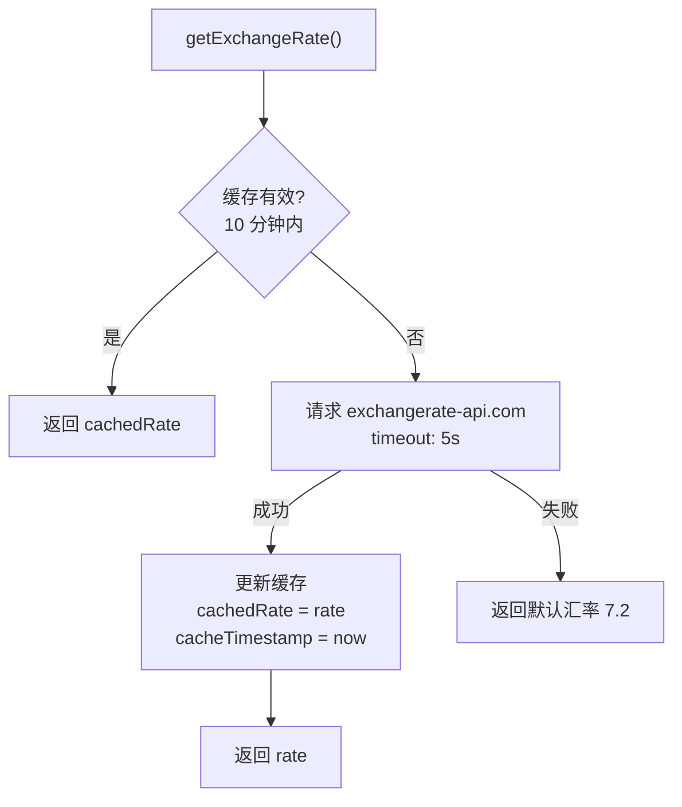
```mermaid
flowchart TD
    A["getExchangeRate()"] --> B{缓存有效?<br/>10 分钟内}
    B -- 是 --> C["返回 cachedRate"]
    B -- 否 --> D["请求 exchangerate-api.com<br/>timeout: 5s"]
    D -- 成功 --> E["更新缓存<br/>cachedRate = rate<br/>cacheTimestamp = now"]
    E --> F["返回 rate"]
    D -- 失败 --> G["返回默认汇率 7.2"]
```

---

## 10. PayPal 手续费计算

```
净金额 = 打赏金额 - (打赏金额 × 4.4% + $0.30)
```

| 打赏金额 | 手续费 | 净金额 |
|----------|--------|--------|
| $1.00 | $0.34 | $0.66 |
| $5.00 | $0.52 | $4.48 |
| $10.00 | $0.74 | $9.26 |
| $20.00 | $1.18 | $18.82 |

---

## 11. 通知机制

### 支付成功后的异步通知

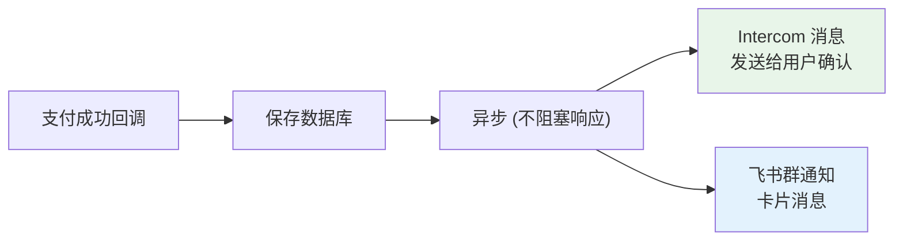
```mermaid
flowchart LR
    A[支付成功回调] --> B[保存数据库]
    B --> C["异步 (不阻塞响应)"]
    C --> D["Intercom 消息<br/>发送给用户确认"]
    C --> E["飞书群通知<br/>卡片消息"]
    
    style D fill:#e8f5e9
    style E fill:#e3f2fd
```

- **Intercom 消息**: 发送 `✅ Thank you! Your $X tip for Agent has been received! 🎉` 到对话中
- **飞书通知**: 根据金额动态选择颜色（$20+ 红色，$10+ 橙色，$5+ 青色，其他绿色），包含客服名、金额、客户邮箱，附带查看对话的链接按钮
- **重试策略**: Intercom 超时不重试（防止重复发送），飞书最多重试 2 次，间隔递增

---

## 12. 部署架构 (Vercel)

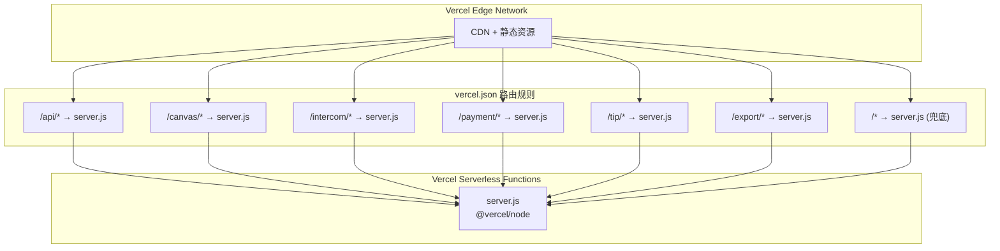
```mermaid
flowchart TD
    subgraph "Vercel Edge Network"
        CDN[CDN + 静态资源]
    end

    subgraph "Vercel Serverless Functions"
        SF["server.js<br/>@vercel/node"]
    end

    subgraph "vercel.json 路由规则"
        R1["/api/* → server.js"]
        R2["/canvas/* → server.js"]
        R3["/intercom/* → server.js"]
        R4["/payment/* → server.js"]
        R5["/tip/* → server.js"]
        R6["/export/* → server.js"]
        R7["/* → server.js (兜底)"]
    end

    CDN --> R1 & R2 & R3 & R4 & R5 & R6 & R7
    R1 & R2 & R3 & R4 & R5 & R6 & R7 --> SF
```

> **关键配置**: `app.set('trust proxy', 1)` — 信任 Vercel 反向代理，正确获取客户端真实 IP，解决 `express-rate-limit` 在代理环境下的报错问题。

---

## 13. API 路由汇总

### 公开路由（无需认证）

| 方法 | 路径 | 描述 |
|------|------|------|
| `GET` | `/tip/:conversationId/:agentName` | 打赏页面 |
| `POST` | `/create-payment` | 创建 PayPal 支付 |
| `GET` | `/payment/success` | 支付成功回调 |
| `GET` | `/payment/cancel` | 支付取消 |
| `POST` | `/canvas/user/initialize` | Canvas 用户端初始化 |
| `POST` | `/canvas/user/submit` | Canvas 用户端操作 |
| `POST` | `/canvas/user/configure` | Configure Flow |
| `POST` | `/canvas/user/submit-sheet` | Sheet 提交 |
| `GET` | `/sheet/agent-name` | 客服名字 Sheet 页 |
| `GET` | `/sheet/user-tip/:convId/:agent` | 用户打赏 Sheet 页 |
| `POST` | `/intercom/initialize` | 客服端插件初始化 |
| `POST` | `/intercom/submit` | 客服端操作 |
| `GET` | `/api/exchange-rate` | 实时汇率查询 |
| `GET` | `/health` | 健康检查 |

### 受保护路由（需 JWT 认证）

| 方法 | 路径 | 描述 |
|------|------|------|
| `GET` | `/` | 管理后台首页（支持 ?report=monthly） |
| `POST` | `/admin/refund/:tipId` | 退款处理 |
| `GET` | `/export/monthly/:year/:month` | Excel 导出 |
| `POST` | `/login` | 管理员登录 |
| `GET` | `/logout` | 退出登录 |

---

## 14. 环境变量清单

| 变量名 | 用途 | 必填 |
|--------|------|------|
| `PORT` | 服务端口 | 否 (默认 3000) |
| `BASE_URL` | 服务基础 URL | 是 |
| `SUPABASE_URL` | Supabase 项目 URL | 是 |
| `SUPABASE_SERVICE_ROLE_KEY` | Supabase 服务角色密钥 | 是 |
| `SUPABASE_ANON_KEY` | Supabase 匿名密钥 | 否 |
| `PAYPAL_CLIENT_ID` | PayPal 客户端 ID | 是 |
| `PAYPAL_CLIENT_SECRET` | PayPal 客户端密钥 | 是 |
| `INTERCOM_ACCESS_TOKEN` | Intercom API Token | 是 |
| `FEISHU_WEBHOOK_URL` | 飞书群 Webhook URL | 否 |
| `JWT_SECRET` | JWT 签名密钥 | 是 |
| `ADMIN_USERNAME` | 管理员用户名 | 否 (默认 admin) |
| `ADMIN_PASSWORD` | 管理员密码 | 否 (默认 mulebuy123) |
| `NODE_ENV` | 运行环境 | 否 |
